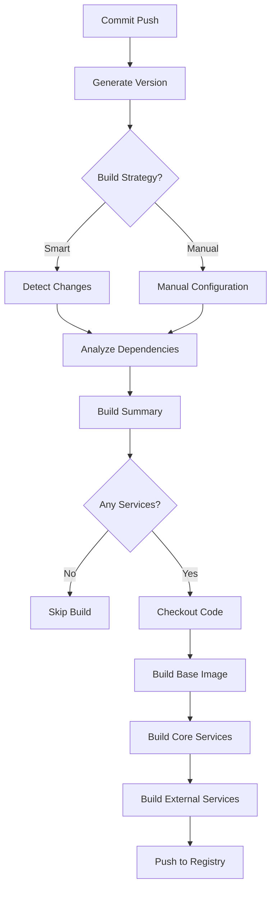

# OpenCRVS Smart Jenkins Pipeline Documentation

## 🚀 Overview

The OpenCRVS Smart Jenkins Pipeline is an intelligent Docker build system that automatically detects changes in your codebase and builds only the necessary services. This dramatically reduces build times while maintaining full control over the build process.

## 📋 Table of Contents

1. [Features](#features)
2. [How It Works](#how-it-works)
3. [Build Strategies](#build-strategies)
4. [Git-Based Versioning](#git-based-versioning)
5. [Change Detection Logic](#change-detection-logic)
6. [Commit Message Integration](#commit-message-integration)
7. [Build Parameters](#build-parameters)
8. [Usage Examples](#usage-examples)
9. [Troubleshooting](#troubleshooting)
10. [Configuration](#configuration)

## ✨ Features

### 🧠 Smart Change Detection
- Automatically analyzes Git changes to determine what services need rebuilding
- Understands service dependencies and build order
- Skips builds entirely when no relevant changes are detected

### 🏷️ Git-Based Versioning
- Automatic version generation from Git tags, branches, and commits
- Different versioning strategies for different branches
- Traceability with Git commit hashes

### ⚡ Build Optimization
- Only builds changed services and their dependencies
- Parallel building with configurable limits
- Efficient resource usage and faster build times

### 🔧 Flexible Configuration
- Multiple build strategies from fully automatic to manual control
- Dry-run mode to preview builds
- Override options for special cases

## 🛠️ How It Works

### Build Process Flow



### Service Architecture

```
┌─────────────────┐
│   Base Image    │ ← Commons, Components, Node.js
└─────────┬───────┘
          │
    ┌─────▼─────┐
    │Core Services│ ← Auth, Gateway, Search, etc.
    └───────────┘

┌─────────────────┐
│External Services│ ← CountryConfig, OpenSearch
└─────────────────┘
```

## 🎯 Build Strategies

### 1. Smart Mode (Recommended)
**Description:** Automatically detects changes and builds only what's needed.

**Use Cases:**
- Daily development builds
- Continuous integration
- Resource optimization

**Example:**
```groovy
BUILD_STRATEGY = 'smart'
```

### 2. All Mode
**Description:** Builds everything (full rebuild).

**Use Cases:**
- Production releases
- Infrastructure changes
- Clean state required

**Example:**
```groovy
BUILD_STRATEGY = 'all'
```

### 3. Core-Only Mode
**Description:** Builds only core OpenCRVS services.

**Use Cases:**
- Core platform updates
- Skip external dependencies

**Example:**
```groovy
BUILD_STRATEGY = 'core-only'
```

### 4. External-Only Mode
**Description:** Builds only external services (CountryConfig, OpenSearch).

**Use Cases:**
- Configuration updates
- Search index changes

**Example:**
```groovy
BUILD_STRATEGY = 'external-only'
```

### 5. Selective Mode
**Description:** Manually specify which services to build.

**Use Cases:**
- Testing specific services
- Hot fixes
- Custom build requirements

**Example:**
```groovy
BUILD_STRATEGY = 'selective'
MANUAL_SERVICES = 'gateway auth user-mgnt'
```

## 🏷️ Git-Based Versioning

### Version Format

The pipeline generates versions based on your Git branch and tags:

| Branch Type | Version Format | Example |
|-------------|----------------|---------|
| `main/master` | `{tag}` | `1.8.0` |
| `develop` | `{tag}-dev.{build}.{commit}` | `1.8.0-dev.123.a1b2c3d4` |
| `feature/*` | `{tag}-{branch}.{build}.{commit}` | `1.8.0-feature-auth.123.a1b2c3d4` |
| Other | `{tag}-{safe-branch}.{build}.{commit}` | `1.8.0-bugfix-123.123.a1b2c3d4` |

### Image Tags

Each built service gets multiple tags:

```bash
# Version-specific tag
toppan-crvs/gateway:1.8.0-dev.123.a1b2c3d4

# Latest tag
toppan-crvs/gateway:latest
```

## 🔍 Change Detection Logic

### Infrastructure Changes → Full Build

These changes trigger a complete rebuild:

```
Dockerfile.base          # Base image definition
package.json            # Root dependencies
yarn.lock              # Dependency locks
tsconfig.json          # TypeScript configuration
```

**Reason:** These affect all services, so everything needs rebuilding.

### Commons/Components Changes → All Core Services

```
packages/commons/       # Shared libraries
packages/components/    # UI components
```

**Reason:** All core services depend on these shared packages.

### Service-Specific Changes → Individual Services

```
packages/gateway/       # Only builds gateway
packages/auth/         # Only builds auth
packages/user-mgnt/    # Only builds user-mgnt
```

**Reason:** Changes are isolated to specific services.

### Build Configuration Changes → Base Rebuild

```
scripts/               # Build scripts
toppan-*.yml          # Compose files
docker-compose*.yml   # Docker configuration
```

**Reason:** Build process changes may affect all services.

## 💬 Commit Message Integration

### Special Commit Messages

Use these patterns in your commit messages to control builds:

#### Force Full Build
```bash
git commit -m "Major infrastructure update [full-build]"
git commit -m "Node.js upgrade [build-all]"
```

#### Build Specific Services
```bash
git commit -m "Fix authentication bug [build:auth,gateway]"
git commit -m "Update user management [build:user-mgnt,notification]"
```

#### No Cache Build
```bash
git commit -m "Clean rebuild required [no-cache]"
```

#### Combined Instructions
```bash
git commit -m "Critical security fix [build:auth,gateway] [no-cache]"
```

## ⚙️ Build Parameters

### Core Parameters

| Parameter | Type | Default | Description |
|-----------|------|---------|-------------|
| `BUILD_STRATEGY` | Choice | `smart` | Build strategy selection |
| `MANUAL_SERVICES` | String | `''` | Space-separated service names |
| `NO_CACHE` | Boolean | `false` | Disable Docker build cache |
| `SEQUENTIAL_BUILD` | Boolean | `false` | Build services one at a time |
| `FORCE_FULL_BUILD` | Boolean | `false` | Override smart detection |
| `PUSH_TO_REGISTRY` | Boolean | `true` | Push images to registry |
| `DRY_RUN` | Boolean | `false` | Preview without building |

### Advanced Parameters

| Parameter | Environment Variable | Description |
|-----------|---------------------|-------------|
| `MAX_PARALLEL` | `MAX_PARALLEL` | Parallel build limit (default: 3) |
| `DOCKER_REGISTRY` | `DOCKER_REGISTRY` | Registry prefix (default: toppan-crvs) |
| `GIT_BRANCH` | `GIT_BRANCH` | Override branch detection |

## 📝 Usage Examples

### Example 1: Daily Development

**Scenario:** You're working on the gateway service and made some changes.

```bash
# Make changes to gateway
vi packages/gateway/src/routes/auth.ts

# Commit with descriptive message
git commit -m "Fix JWT token validation in gateway"

# Push to trigger build
git push origin feature/fix-jwt
```

**Pipeline Result:**
```
🔍 Smart Change Detection...
📋 Changed files:
  - packages/gateway/src/routes/auth.ts

📦 Core service change: gateway
📋 Smart Build Plan:
  Build Reason: Smart build (1 core, 0 external services)
  Force Base Rebuild: false
  Core Services: gateway
  External Services: none

🏗️ Building base image (if needed)...
🚀 Building core services: gateway
```

### Example 2: Commons Library Update

**Scenario:** You updated a shared utility function used by multiple services.

```bash
# Update shared library
vi packages/commons/src/utils/date-helper.ts

# Commit changes
git commit -m "Add new date formatting utilities"
git push origin develop
```

**Pipeline Result:**
```
🔍 Smart Change Detection...
📋 Changed files:
  - packages/commons/src/utils/date-helper.ts

⚡ Commons/Components change - rebuilding all core services
📋 Smart Build Plan:
  Build Reason: Smart build (17 core, 0 external services)
  Force Base Rebuild: true
  Core Services: config auth user-mgnt notification search metrics documents gateway workflow webhooks events client login migration data-seeder toppan toppan-service toppan-ui
```

### Example 3: Infrastructure Update

**Scenario:** You're upgrading the Node.js version in the base image.

```bash
# Update base Dockerfile
vi Dockerfile.base

# Commit with full build instruction
git commit -m "Upgrade to Node.js 18.20.4 [full-build]"
git push origin main
```

**Pipeline Result:**
```
🔍 Smart Change Detection...
📋 Changed files:
  - Dockerfile.base

⚡ Infrastructure change detected - force full build
🏗️ Full build requested in commit message
📋 Smart Build Plan:
  Build Reason: Full build (infrastructure changes or requested)
  Force Base Rebuild: true
  Core Services: [all 17 services]
  External Services: countryconfig opensearch toppan-data-seeder
```

### Example 4: Hot Fix for Specific Services

**Scenario:** Critical security fix needed for auth and gateway only.

```bash
# Make security fixes
vi packages/auth/src/features/authenticate/handler.ts
vi packages/gateway/src/routes/user.ts

# Commit with specific build instruction
git commit -m "Critical security fix for token validation [build:auth,gateway] [no-cache]"
git push origin hotfix/security-fix
```

**Pipeline Result:**
```
🔍 Smart Change Detection...
🎯 Specific services requested in commit: [auth, gateway]
🚫 No cache requested in commit message
📋 Smart Build Plan:
  Build Reason: Smart build (2 core, 0 external services)
  Core Services: auth gateway
  No Cache: true
```

### Example 5: Dry Run Preview

**Scenario:** You want to see what would be built without actually building.

```bash
# Set DRY_RUN parameter to true in Jenkins
BUILD_STRATEGY = 'smart'
DRY_RUN = true
```

**Pipeline Result:**
```
📊 Final Build Configuration:
  Version: 1.8.0-feature-xyz.45.a1b2c3d4
  Build Reason: Smart build (3 core, 1 external services)
  Core Services: auth gateway user-mgnt
  External Services: countryconfig

🔍 DRY RUN MODE - Build would proceed with above configuration
Set DRY_RUN to false to execute actual build
```

## 🏗️ Service Lists

### Core Services
These services depend on the base image and are built from the main repository:

```
config           # Configuration service
auth             # Authentication service
user-mgnt        # User management
notification     # Notification system
search           # Search functionality
metrics          # Analytics and metrics
documents        # Document management
gateway          # API Gateway
workflow         # Business process workflows
webhooks         # Webhook handling
events           # Event processing
client           # Frontend application
login            # Login interface
migration        # Database migrations
data-seeder      # Initial data seeding
toppan           # Toppan integration
toppan-service   # Toppan backend service
toppan-ui        # Toppan user interface
```

### External Services
These services are built from separate repositories:

```
countryconfig    # Country-specific configuration
opensearch       # Search engine service
toppan-data-seeder # Toppan-specific data seeding
```

## 🔧 Troubleshooting

### Common Issues

#### Issue: Build Skipped When It Shouldn't Be

**Symptoms:**
```
ℹ️ No changes detected, will skip build unless forced
✅ No services need building - skipping build stages
```

**Solutions:**
1. Use `FORCE_FULL_BUILD = true` parameter
2. Add `[full-build]` to commit message
3. Check if files were committed properly: `git log --stat`

#### Issue: Base Image Not Rebuilding

**Symptoms:**
- Services fail to build due to missing dependencies
- "Base image already exists" message when it should rebuild

**Solutions:**
1. Trigger base rebuild by:
   - Modifying `packages/commons/` or `packages/components/`
   - Setting `FORCE_FULL_BUILD = true`
   - Adding `base` to `MANUAL_SERVICES`

#### Issue: Wrong Services Being Built

**Symptoms:**
- Pipeline builds unexpected services
- Services you expect aren't being built

**Solutions:**
1. Check the "Smart Build Plan" output in logs
2. Verify commit includes the files you changed: `git show --name-only`
3. Use `DRY_RUN = true` to preview without building
4. Check for typos in `[build:service1,service2]` commit messages

#### Issue: Version Generation Fails

**Symptoms:**
```
error: fatal: No names found, cannot describe anything.
```

**Solutions:**
1. Create an initial Git tag: `git tag v1.8.0`
2. Push the tag: `git push origin v1.8.0`
3. Ensure Jenkins has proper Git access

### Debugging Tips

#### 1. Check Change Detection
Look for this section in build logs:
```
🔍 Smart Change Detection...
📋 Changed files:
  - packages/gateway/src/handler.ts
🔍 Analyzing: packages/gateway/src/handler.ts
📦 Core service change: gateway
```

#### 2. Verify Build Plan
Always check the build plan summary:
```
📋 Smart Build Plan:
  Build Reason: Smart build (1 core, 0 external services)
  Force Base Rebuild: false
  Core Services: gateway
  External Services: none
```

#### 3. Use Dry Run Mode
Set `DRY_RUN = true` to see what would happen without building.

#### 4. Check Service Lists
Verify service names match exactly:
- ✅ `user-mgnt` (correct)
- ❌ `user-management` (incorrect)

## ⚙️ Configuration

### Jenkins Pipeline Setup

1. **Create Pipeline Job**
   - New Item → Pipeline
   - Copy `Jenkinsfile` to your repository root

2. **Configure Credentials**
   - `docker-registry-credentials`: Docker Hub/ECR credentials
   - `aws-codecommit-credentials`: AWS CodeCommit access

3. **Set Environment Variables**
   ```groovy
   DOCKER_REGISTRY = 'your-registry'
   MAX_PARALLEL = '3'
   ```

### Repository Structure

Ensure your repositories are structured as expected:

```
opencrvs-core/
├── Jenkinsfile                 # This pipeline
├── Dockerfile.base            # Base image
├── toppan-build.yml          # Core services build config
├── toppan-build-ext.yml      # External services build config
├── packages/
│   ├── auth/
│   ├── gateway/
│   └── ...
└── scripts/
    └── build-docker-compose.sh

opencrvs-countryconfig/         # External repo
└── Dockerfile

opensearch/                     # External repo
├── Dockerfile.opensearch
└── Dockerfile.seeder
```

### Webhooks Configuration

For automatic triggering:

1. **GitHub/GitLab Webhooks**
   - Point to: `http://jenkins.example.com/github-webhook/`
   - Events: Push, Pull Request

2. **AWS CodeCommit**
   - Use CloudWatch Events + Lambda
   - Trigger Jenkins API on repository changes

## 📚 Advanced Usage

### Custom Build Scripts

The pipeline uses your existing `build-docker-compose.sh` script:

```bash
# The pipeline essentially runs:
./scripts/build-docker-compose.sh --parallel gateway auth

# With environment variables:
VERSION=1.8.0-dev.123.a1b2c3d4
DOCKER_REGISTRY=toppan-crvs
```

### Multi-Branch Builds

Different branches get different treatment:

- `main` → Production builds, full versions
- `develop` → Development builds, pre-release versions
- `feature/*` → Feature builds, branch-specific versions

### Registry Management

Images are tagged and pushed automatically:

```bash
# Version-specific
toppan-crvs/gateway:1.8.0-dev.123.a1b2c3d4

# Latest for the branch
toppan-crvs/gateway:latest
```

### Integration with Deployment

Use the generated version in your deployment scripts:

```yaml
# docker-compose.yml
services:
  gateway:
    image: ${DOCKER_REGISTRY}/gateway:${VERSION}
```

## 🚀 Benefits

### Time Savings
- **Before:** 45-60 minute full builds every commit
- **After:** 5-15 minute incremental builds for most changes

### Resource Efficiency
- Reduced Docker registry storage
- Lower CI/CD compute costs
- Faster feedback loops

### Developer Experience
- Immediate feedback on changes
- Clear build reasons and logs
- Flexible override options

---

## 🤝 Contributing

When contributing to this pipeline:

1. Test changes with `DRY_RUN = true` first
2. Update this documentation for any new features
3. Ensure backward compatibility with existing builds
4. Add examples for new functionality

---

**Happy Building! 🚀**