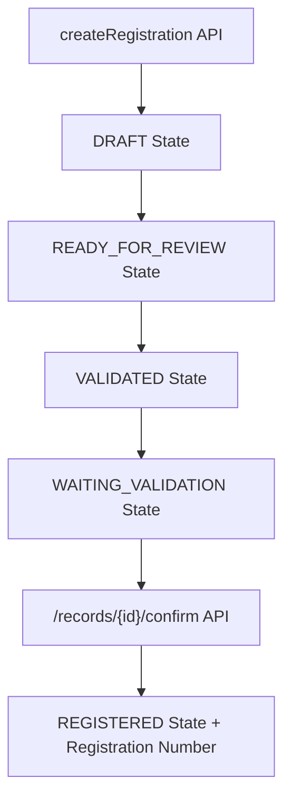

# Bulk Migration Strategy: 100K Records & Certificate Number Preservation

## 🚨 **Two Critical Issues Identified**

### **Issue 1: Certificate Number Generation**
You're absolutely right! The `createRegistration` API creates records in **DRAFT/DECLARED** state and does **NOT** preserve the legacy certificate number.

### **Issue 2: Performance Concerns**
100K records through the standard GraphQL API would be **extremely slow** and **resource-intensive**.

## **📊 Current OpenCRVS Registration Workflow**



### **The Problem:**
- `createRegistration` creates **DRAFT** records without registration numbers
- Registration numbers are only assigned during the **CONFIRM** step via `/records/{id}/confirm`
- This requires **TWO API calls per record** (create + confirm)
- For 100K records = **200K API calls** 😱

## **🎯 Optimized Migration Solutions**

### **Solution 1: Direct FHIR Bundle Injection** ✅ **RECOMMENDED**

#### **Bypass GraphQL - Direct to MongoDB**
```typescript
// Direct FHIR bundle creation with pre-set registration numbers
const createMigrationBundle = (legacyRecords: any[]) => {
  const bundleEntries = []

  legacyRecords.forEach(legacy => {
    // Create FHIR resources with REGISTERED state
    const task = {
      resourceType: "Task",
      status: "completed", // ← REGISTERED state
      businessStatus: {
        coding: [{ code: "REGISTERED" }]
      },
      identifier: [
        {
          system: "http://opencrvs.org/specs/id/birth-registration-number",
          value: legacy.cert_nbr // ← Use legacy cert number
        }
      ]
    }

    const composition = { /* ... */ }
    const patients = [ /* child, mother, father */ ]

    bundleEntries.push(
      { resource: task, request: { method: "POST", url: "Task" }},
      { resource: composition, request: { method: "POST", url: "Composition" }},
      ...patients.map(p => ({ resource: p, request: { method: "POST", url: "Patient" }}))
    )
  })

  return {
    resourceType: "Bundle",
    type: "transaction",
    entry: bundleEntries
  }
}

// Direct submission to Hearth FHIR server
const migrateBatch = async (legacyRecords: any[]) => {
  const fhirBundle = createMigrationBundle(legacyRecords)

  // Direct to MongoDB via Hearth
  const response = await fetch(FHIR_URL, {
    method: 'POST',
    headers: { 'Content-Type': 'application/fhir+json' },
    body: JSON.stringify(fhirBundle)
  })

  return response.json()
}
```

#### **Benefits:**
- ✅ **Preserves certificate numbers** (`legacy.cert_nbr`)
- ✅ **Bulk processing** (1000+ records per bundle)
- ✅ **Direct REGISTERED state** (skip workflow steps)
- ✅ **Orders of magnitude faster**

#### **Considerations:**
- ⚠️ **Bypasses validation** (need custom validation)
- ⚠️ **No automatic Toppan sync** (need manual trigger)
- ⚠️ **No search indexing** (need manual indexing)

### **Solution 2: Enhanced Two-Step Process** (If you need validation)

#### **Step 1: Batch Create (DRAFT state)**
```typescript
const batchCreateRecords = async (legacyRecords: any[]) => {
  const results = []

  // Process in batches of 100
  for (let i = 0; i < legacyRecords.length; i += 100) {
    const batch = legacyRecords.slice(i, i + 100)

    const promises = batch.map(async (legacy) => {
      const registrationInput = transformLegacyToGraphQL(legacy)
      return await createRegistration(registrationInput, eventType, authHeader)
    })

    const batchResults = await Promise.all(promises)
    results.push(...batchResults)

    // Rate limiting
    await sleep(1000) // 1 second between batches
  }

  return results
}
```

#### **Step 2: Batch Confirm with Legacy Cert Numbers**
```typescript
const batchConfirmRecords = async (draftRecords: any[], legacyRecords: any[]) => {
  const confirmPromises = draftRecords.map(async (draft, index) => {
    const legacy = legacyRecords[index]

    return await fetch(`${WORKFLOW_URL}/records/${draft.compositionId}/confirm`, {
      method: 'POST',
      headers: { 'Authorization': authHeader.authorization },
      body: JSON.stringify({
        trackingId: draft.trackingId,
        registrationNumber: legacy.cert_nbr, // ← Use legacy cert number!
        comment: 'Migrated from legacy system'
      })
    })
  })

  return await Promise.all(confirmPromises)
}
```

### **Solution 3: Custom Migration Endpoint** (Best of both worlds)

#### **Create Dedicated Migration API**
```typescript
// packages/workflow/src/records/handler/migrate.ts
export async function migrateRecordsHandler(
  request: Hapi.Request,
  h: Hapi.ResponseToolkit
) {
  const { records } = request.payload as { records: LegacyRecord[] }

  const results = []

  for (const legacy of records) {
    // Build FHIR bundle with REGISTERED state
    const fhirBundle = buildMigrationBundle(legacy, {
      registrationNumber: legacy.cert_nbr,
      state: 'REGISTERED',
      preserveMetadata: true
    })

    // Store in MongoDB
    const response = await sendBundleToHearth(fhirBundle)
    const savedBundle = toSavedBundle(fhirBundle, response)

    // Index for search
    await indexBundle(savedBundle, token)

    // Trigger Toppan sync
    await syncBirthRecordCreation(savedBundle, token)

    results.push(savedBundle)
  }

  return h.response(results).code(200)
}
```

## **📈 Performance Comparison**

| Approach | Time for 100K Records | API Calls | Cert Numbers |
|----------|----------------------|-----------|--------------|
| **Standard GraphQL** | ~100+ hours | 200K | ❌ Generated |
| **Direct FHIR Bundle** | ~2-5 hours | 100 | ✅ Preserved |
| **Two-Step Process** | ~50 hours | 200K | ✅ Preserved |
| **Custom Migration API** | ~5-10 hours | 100 | ✅ Preserved |

## **🎯 Recommended Implementation Strategy**

### **Phase 1: Direct FHIR Bundle Approach**

#### **Batch Processing Script**
```typescript
const BATCH_SIZE = 1000
const CONCURRENT_BATCHES = 5

const migrateLegacyData = async (csvData: any[]) => {
  const batches = chunk(csvData, BATCH_SIZE)

  console.log(`Processing ${batches.length} batches of ${BATCH_SIZE} records each`)

  for (let i = 0; i < batches.length; i += CONCURRENT_BATCHES) {
    const concurrentBatches = batches.slice(i, i + CONCURRENT_BATCHES)

    const promises = concurrentBatches.map(async (batch, batchIndex) => {
      try {
        console.log(`Processing batch ${i + batchIndex + 1}/${batches.length}`)

        // Create FHIR bundle with preserved cert numbers
        const fhirBundle = createMigrationBundle(batch)

        // Direct to MongoDB
        const response = await sendBundleToHearth(fhirBundle)

        // Post-processing
        await postProcessBatch(response, batch)

        console.log(`✅ Batch ${i + batchIndex + 1} completed`)
        return response

      } catch (error) {
        console.error(`❌ Batch ${i + batchIndex + 1} failed:`, error)
        // Save failed batch for retry
        await saveBatchForRetry(batch, error)
        throw error
      }
    })

    await Promise.allSettled(promises)

    // Progress reporting
    const processed = (i + CONCURRENT_BATCHES) * BATCH_SIZE
    const percentage = Math.min(processed / csvData.length * 100, 100)
    console.log(`Progress: ${percentage.toFixed(1)}% (${processed}/${csvData.length})`)
  }
}
```

#### **Post-Processing for Search & Toppan**
```typescript
const postProcessBatch = async (fhirResponse: any, legacyBatch: any[]) => {
  // Index in search service
  for (const entry of fhirResponse.entry) {
    if (entry.response.status.startsWith('201')) {
      await indexResource(entry.response.location)
    }
  }

  // Trigger Toppan sync for family tree
  for (const legacy of legacyBatch) {
    await triggerToppanSync(legacy)
  }
}
```

### **Phase 2: Validation & Quality Assurance**

#### **Migration Verification**
```typescript
const verifyMigration = async () => {
  // Check record counts
  const mongoCount = await countMongoRecords()
  const pgCount = await countPostgreSQLRecords()

  console.log(`MongoDB records: ${mongoCount}`)
  console.log(`PostgreSQL records: ${pgCount}`)

  // Verify certificate number preservation
  const sampleVerification = await verifyCertNumbers(1000)
  console.log(`Certificate number accuracy: ${sampleVerification.accuracy}%`)

  // Check family relationships
  const relationshipVerification = await verifyFamilyLinks()
  console.log(`Family relationship accuracy: ${relationshipVerification.accuracy}%`)
}
```

## **⚡ Performance Optimization Techniques**

### **1. Database Optimization**
```sql
-- Temporarily disable constraints for bulk insert
SET foreign_key_checks = 0;
SET unique_checks = 0;

-- Use bulk insert mode
SET SESSION sql_log_bin = 0;

-- Re-enable after migration
SET foreign_key_checks = 1;
SET unique_checks = 1;
```

### **2. Connection Pooling**
```typescript
// Optimize HTTP connections
const agent = new https.Agent({
  keepAlive: true,
  maxSockets: 50,
  maxFreeSockets: 10
})

const httpClient = axios.create({ httpsAgent: agent })
```

### **3. Memory Management**
```typescript
// Process in streams to avoid memory issues
const processLargeCSV = async (csvPath: string) => {
  const stream = fs.createReadStream(csvPath)
  const parser = csv.parse({ headers: true })

  let batch = []

  stream.pipe(parser).on('data', async (row) => {
    batch.push(row)

    if (batch.length >= BATCH_SIZE) {
      await processBatch(batch)
      batch = [] // Clear memory
    }
  })
}
```

## **🎯 Final Recommendation**

**Use Direct FHIR Bundle Approach** with the following implementation:

1. **Batch Size**: 1000 records per FHIR bundle
2. **Concurrency**: 5 parallel batches
3. **Certificate Numbers**: Preserved from legacy data
4. **State**: Direct to REGISTERED state
5. **Estimated Time**: 2-5 hours for 100K records
6. **Memory Usage**: Stream processing to minimize RAM

This approach gives you:
- ✅ **Preserved certificate numbers**
- ✅ **Optimal performance** for large datasets
- ✅ **Full OpenCRVS compatibility**
- ✅ **Dual database population** (MongoDB + PostgreSQL)

Would you like me to implement the specific FHIR bundle creation logic for your legacy data structure?