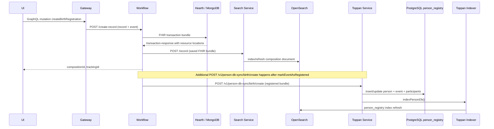

# OpenCRVS Registration Persistence Flow

This note captures how a registration declared through the UI travels across services and persists into MongoDB, PostgreSQL (Toppan person registry), and OpenSearch. Use it as the canonical reference when designing tooling that should mimic the user-driven workflow (for example, CSV-driven migrations).

## End-to-End Overview

## Stage-by-stage Details

### 1. Client UI (React + Apollo)
- The birth declaration flow issues the `createBirthRegistration` GraphQL mutation defined in `packages/client/src/views/DataProvider/birth/mutations.ts:20` once the registrar submits the form.
- Payload shape is driven by the GraphQL schema (`BirthRegistrationInput`) in `packages/gateway/src/features/registration/schema.graphql:588-671` and mirrors what a migration script must produce.

### 2. GraphQL Gateway
- Resolver `Mutation.createBirthRegistration` (`packages/gateway/src/features/registration/root-resolvers.ts:324-350`) validates attachments, enforces scopes, and forwards the request to the workflow service.
- Forwarding happens via `createRegistration` (`packages/gateway/src/workflow/index.ts:135-150`), which POSTs `{ record, event }` to the workflow route `/create-record` with the caller’s JWT propagated in headers.

### 3. Workflow `/create-record`
- The handler (`packages/workflow/src/records/handler/create.ts:362-528`) performs several orchestrated steps:
  - Normalises questionnaire-derived identifiers, resolves duplicates, and uploads base64 attachments on the caller’s behalf (`packages/workflow/src/records/handler/create.ts:368-444`).
  - Builds a FHIR transaction bundle from the GraphQL payload via `buildFHIRBundle` (`packages/workflow/src/records/handler/create.ts:184-308`).
  - Persists the bundle to Hearth using `sendBundleToHearth` (`packages/workflow/src/records/fhir.ts:1143-1181`), then merges response IDs with the bundle through `toSavedBundle`.
  - Establishes task state, practitioner context, duplicate markers, audit trail, notifications, and returns the new `compositionId`, `trackingId`, and duplicate flag to the caller.
- Environment variables such as `FHIR_URL`, `SEARCH_URL`, and `TOPPAN_URL` are sourced from `packages/workflow/src/environment.ts:14-31` and govern the downstream endpoints this handler calls.

### 4. Hearth FHIR Server → MongoDB
- `sendBundleToHearth` posts the bundle to `${FHIR_URL}` (defaults to `http://localhost:3447/fhir`). Hearth validates the transaction and writes each resource into the corresponding MongoDB collection (e.g., `composition`, `patient`, `task`).
- The transaction response returns `location` headers (FHIR resource URIs) which are mapped back onto the saved bundle, ensuring Mongo `_id` values propagate through the workflow layer.

### 5. Workflow Side-effects
- After Hearth persistence, the handler indexes the saved bundle by calling `indexBundle` (`packages/workflow/src/records/handler/create.ts:482-523`), which delegates to the search service (`packages/workflow/src/records/search.ts:15-32`).
- Additional actions include `auditEvent`, notification dispatch, and country-config webhooks so the record immediately participates in the wider workflow lifecycle.

### 6. Search Service → OpenSearch
- The search service accepts `POST /record` (`packages/search/src/config/routes.ts:111-134`) and routes to `recordHandler` (`packages/search/src/features/registration/record/handler.ts:19-41`).
- `recordHandler` selects the correct event-specific indexer (birth/death/marriage) which composes a flattened search document and calls `indexComposition` (`packages/search/src/elasticsearch/dbhelper.ts:16-37`).
- OpenSearch connectivity is provided by `@elastic/elasticsearch` with host configuration in `packages/search/src/elasticsearch/client.ts:11-59`.
- The resulting document is written to the `OPENCRVS_INDEX_NAME` index, making the record searchable for assignment, deduplication, and reporting.

### 7. Registration Callback → Toppan Service
- Toppan synchronisation is triggered when a record transitions to “registered.” The callback handler `markEventAsRegisteredCallbackHandler` invokes `syncBirthRecordCreation` (`packages/workflow/src/features/registration/handler.ts:70-82`) once registration succeeds.
- `syncBirthRecordCreation` guards on `TOPPAN_ENABLED` and delegates to `syncRecordCreation` (`packages/workflow/src/integrations/toppan/index.ts:13-32`), which POSTs the saved bundle to `${TOPPAN_URL}/v1/person-db-sync/birth/create` (`packages/workflow/src/integrations/toppan/client.ts:32-60`).

### 8. Toppan Service → PostgreSQL + OpenSearch refresh
- The Toppan service’s birth create handler (`packages/toppan/src/person-db-sync/birth/create.ts:22-125`) unwraps the bundle, maps FHIR resources into relational rows, and writes them inside a transaction to `person`, `event`, and `event_participant` tables.
- Database helpers in `packages/toppan/src/database.ts:1-238` handle connection pooling, per-event advisory locks, and inserts/update semantics to keep the registry consistent and idempotent.
- After the transaction, the handler marks the sync request complete and calls `indexPersonDb` via `triggerReindex()` (`packages/toppan/src/person-db-sync/birth/create.ts:536-542`). This re-populates the Toppan-specific OpenSearch index used for advanced person search.

## Key Data Artifacts

| Stage | Artifact | Notes |
| ----- | -------- | ----- |
| UI → Gateway | `BirthRegistrationInput` | GraphQL abstraction of the form; must be populated by migration tooling to mirror manual declarations. |
| Gateway → Workflow | FHIR transaction bundle | Contains Composition, Task, Patient, RelatedPerson, Encounter, Location and attachment references. |
| Workflow → Hearth | HTTP `POST ${FHIR_URL}` | Persists record to MongoDB collections managed by Hearth. |
| Workflow → Search | Saved bundle | Contains Mongo-assigned resource IDs; forms the basis of search indexing. |
| Workflow → Toppan | Saved bundle (registered state) | Forwarded only after `markBirthAsRegistered`; includes registration number and audit trail. |
| Toppan → PostgreSQL | `person`, `event`, `event_participant` rows | Normalised representation used by the legacy Toppan ecosystem. |
| Toppan → OpenSearch | Person registry index | Enables cross-registry search via `/opensearch/index-person-db`. |

## Migration Checklist (CSV → Platform)
1. Transform each CSV row into a valid GraphQL `BirthRegistrationInput` (or the corresponding event type) matching the schema in `packages/gateway/src/features/registration/schema.graphql:588-671`.
2. Authenticate as a user with declaration scopes and call the public GraphQL mutation `createBirthRegistration`. This automatically executes the UI → Gateway → Workflow → Hearth → Search sequence and returns `compositionId` + `trackingId`.
3. Drive the record through the normal status transitions (`markBirthAsValidated`, `markBirthAsRegistered`, etc.) so that `syncBirthRecordCreation` runs and the record is written into PostgreSQL via the Toppan service.
4. Monitor the workflow and Toppan service logs to confirm that MongoDB, PostgreSQL, and OpenSearch all converge (e.g., look for `✅ Birth record synced with Toppan` and `✅ OpenSearch index updated`).
5. For idempotent retries, reuse the `trackingId` or draft identifiers so duplicate detection in `createRecordHandler` can short-circuit if the record already exists.

Following the user journey in this order guarantees that migration tooling produces indistinguishable records from those captured manually, with MongoDB, PostgreSQL, and OpenSearch remaining in sync.
