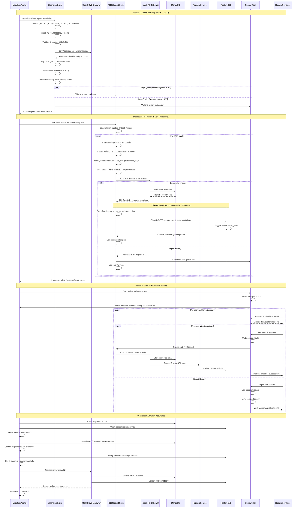
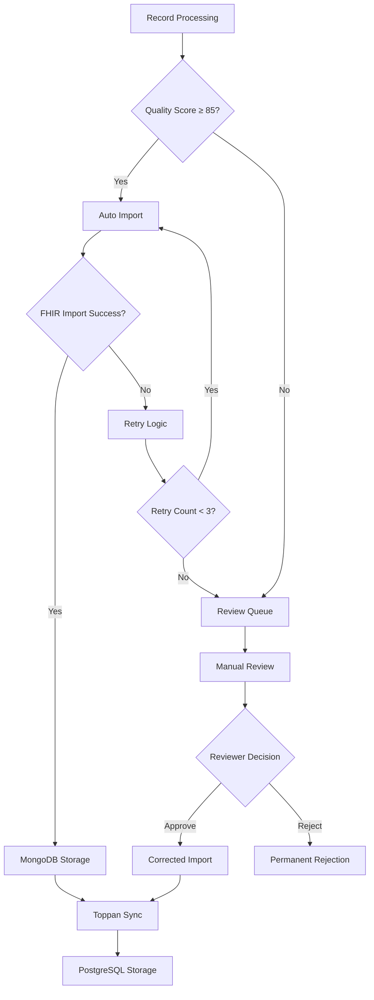
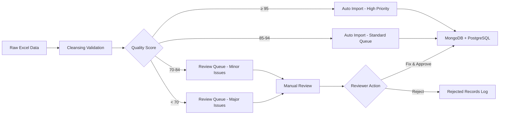

# OpenCRVS Legacy Data Migration - Sequence Diagram

## Complete Migration Flow: Excel → OpenCRVS Dual Database



## Key Technical Details

### 1. **Data Transformation Stages**

| Stage | Input | Output | Key Operations |
|-------|--------|---------|----------------|
| **Cleansing** | Excel files (73 cols) | CSV files | Parish mapping, quality scoring, validation |
| **FHIR Import** | Cleansed CSV | MongoDB FHIR | Bundle creation, certificate preservation |
| **Toppan Sync** | FHIR resources | PostgreSQL | Person normalization, family links |
| **Review Tool** | Failed records | Corrected data | Manual validation, re-import |

### 2. **Error Handling Flow**



### 3. **Performance Characteristics**

| Process | Batch Size | Concurrency | Est. Time (100K records) |
|---------|------------|-------------|-------------------------|
| **Data Cleansing** | 5000 records | Single-threaded | ~30 minutes |
| **FHIR Import** | 1000 records | 5 parallel batches | ~2-5 hours |
| **Manual Review** | 1 record | Human-paced | Variable |
| **Total Migration** | - | - | ~6-8 hours + review time |

### 4. **Data Quality Gates**



## Implementation Commands

```bash
# Phase 1: Data Cleansing
node scripts/1-cleansing.js --input data-migration/ --output cleansed/

# Phase 2: FHIR Import
node scripts/2-fhir-import.js --input cleansed/import-ready.csv --batch-size 1000

# Phase 3: Review Tool
node scripts/3-review-tool.js --port 3001 --queue cleansed/review-queue.csv

# Verification
node scripts/verify-migration.js --check-counts --sample-size 1000
```

This sequence diagram illustrates the complete end-to-end migration process, showing how legacy Excel data flows through our three-phase approach into OpenCRVS's dual-database architecture while preserving certificate numbers and maintaining data quality through automated scoring and manual review processes.