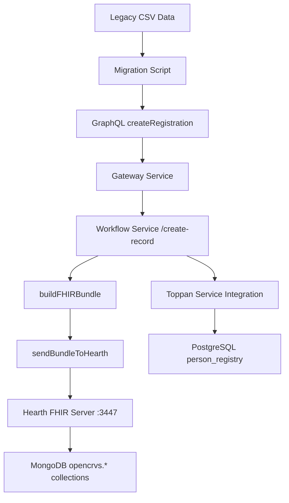

# MongoDB Data Flow Analysis: How Migration Data Gets Stored

## 🔄 Complete Data Flow Pathway

### **The Journey: Legacy CSV → MongoDB**



## 1️⃣ **Migration Entry Point: GraphQL API**

### **Migration Script Calls OpenCRVS API**
```typescript
// Migration script creates registration via GraphQL
const registrationInput: GQLBirthRegistrationInput = {
  child: {
    name: [{ firstNamesEng: legacy.c_frst_nm, familyNameEng: legacy.c_last_nm }],
    gender: mapGender(legacy.c_sex),
    birthDate: parseDate(legacy.c_dob)
  },
  mother: { /* ... */ },
  father: { /* ... */ },
  registration: {
    registrationNumber: legacy.cert_nbr,
    paperFormID: legacy.entry_nbr,
    informantType: mapInformantType(legacy.i_desc)
  },
  eventLocation: {
    id: resolveLocationUUID(legacy.parish_nm)
  }
}

// Call OpenCRVS GraphQL mutation
const result = await graphqlClient.mutate({
  mutation: CREATE_BIRTH_REGISTRATION,
  variables: { details: registrationInput }
})
```

## 2️⃣ **Gateway Service Processing**

### **packages/gateway/src/features/registration/root-resolvers.ts**
```typescript
// GraphQL resolver calls workflow service
async createBirthRegistration(_, { details }, { headers: authHeader }) {
  try {
    await validateBirthDeclarationAttachments(details)
  } catch (error) {
    throw new UserInputError(error.message)
  }
  return await createRegistration(details, EVENT_TYPE.BIRTH, authHeader)
}
```

### **packages/gateway/src/workflow/index.ts**
```typescript
// Gateway forwards to workflow service
export async function createRegistration(
  record: GQLBirthRegistrationInput | GQLDeathRegistrationInput | GQLMarriageRegistrationInput,
  event: EVENT_TYPE,
  authHeader: IAuthHeader
) {
  const res = await createRequest<{
    compositionId: string
    trackingId: string
    isPotentiallyDuplicate: boolean
  }>('POST', '/create-record', authHeader, { record, event })

  return res
}
```

**Key Point**: Gateway service forwards to workflow service at `WORKFLOW_URL/create-record`

## 3️⃣ **Workflow Service: FHIR Bundle Creation**

### **packages/workflow/src/records/handler/create.ts**
```typescript
// Main creation handler
export async function createRecord(request: Hapi.Request, h: Hapi.ResponseToolkit) {
  const { event, record: recordDetails } = validateRequest(request, requestSchema)

  // Step 1: Build FHIR Bundle from GraphQL input
  const inputBundle = buildFHIRBundle(recordDetails, event)

  // Step 2: Send to Hearth FHIR server (MongoDB storage)
  const responseBundle = await sendBundleToHearth(inputBundle)

  // Step 3: Create saved bundle with MongoDB IDs
  const savedBundle = toSavedBundle(inputBundle, responseBundle)

  // Step 4: Set initial workflow state
  const record = inProgress
    ? changeState(savedBundle, 'IN_PROGRESS')
    : changeState(savedBundle, 'READY_FOR_REVIEW')

  return record
}
```

### **FHIR Bundle Creation Process**
```typescript
// buildFHIRBundle converts GraphQL input to FHIR resources
const inputBundle = buildFHIRBundle(recordDetails, event)
// Produces:
{
  resourceType: "Bundle",
  type: "transaction",
  entry: [
    {
      resource: {
        resourceType: "Composition",
        section: [/* links to all other resources */]
      },
      request: { method: "POST", url: "Composition" }
    },
    {
      resource: {
        resourceType: "Task",
        status: "draft",
        businessStatus: { coding: [{ code: "DECLARED" }] }
      },
      request: { method: "POST", url: "Task" }
    },
    {
      resource: {
        resourceType: "Patient", // Child
        name: [{ given: ["John"], family: "Doe" }],
        gender: "male",
        birthDate: "1990-01-01"
      },
      request: { method: "POST", url: "Patient" }
    },
    {
      resource: {
        resourceType: "Patient", // Mother
        name: [{ given: ["Jane"], family: "Doe" }]
      },
      request: { method: "POST", url: "Patient" }
    },
    // ... more resources (father, informant, location, etc.)
  ]
}
```

## 4️⃣ **Hearth FHIR Server: MongoDB Storage**

### **packages/workflow/src/records/fhir.ts**
```typescript
export async function sendBundleToHearth(
  bundle: Bundle
): Promise<TransactionResponse> {
  const res = await fetch(FHIR_URL, {  // http://localhost:3447/fhir
    method: 'POST',
    body: JSON.stringify({
      ...bundle,
      entry: bundle.entry.filter(
        ({ resource: { resourceType } }) => !resourceType.endsWith('History')
      )
    }),
    headers: {
      'Content-Type': 'application/fhir+json'
    }
  })

  if (!res.ok) {
    throw new Error(`FHIR transaction failed: ${res.status}`)
  }

  return res.json() // Returns transaction response with generated IDs
}
```

### **What Happens in Hearth FHIR Server**
1. **Receives FHIR Bundle**: Transaction bundle with multiple resources
2. **Validates FHIR Compliance**: Ensures resources meet FHIR R4 standard
3. **Generates MongoDB IDs**: Creates ObjectId for each resource
4. **Stores in MongoDB Collections**:
   ```javascript
   // MongoDB collections created by Hearth
   db.patient.insertOne({
     _id: ObjectId("507f1f77bcf86cd799439011"),
     resourceType: "Patient",
     id: "507f1f77bcf86cd799439011",
     name: [{ given: ["John"], family: "Doe" }],
     gender: "male",
     birthDate: "1990-01-01"
   })

   db.composition.insertOne({
     _id: ObjectId("507f1f77bcf86cd799439012"),
     resourceType: "Composition",
     id: "507f1f77bcf86cd799439012",
     section: [
       { entry: [{ reference: "Patient/507f1f77bcf86cd799439011" }] }
     ]
   })

   db.task.insertOne({
     _id: ObjectId("507f1f77bcf86cd799439013"),
     resourceType: "Task",
     id: "507f1f77bcf86cd799439013",
     status: "draft"
   })
   ```

5. **Returns Transaction Response**:
   ```json
   {
     "resourceType": "Bundle",
     "type": "transaction-response",
     "entry": [
       {
         "response": {
           "status": "201 Created",
           "location": "Patient/507f1f77bcf86cd799439011"
         }
       }
     ]
   }
   ```

## 5️⃣ **MongoDB Storage Structure**

### **MongoDB Database: `opencrvs`**
```javascript
// Collections created by Hearth FHIR server
use opencrvs

// Main registration data
db.composition.find()      // Registration compositions
db.patient.find()          // Person data (child, mother, father, etc.)
db.task.find()             // Workflow tasks and states
db.relatedperson.find()    // Informants, witnesses
db.location.find()         // Event locations
db.encounter.find()        // Event encounters
db.observation.find()      // Additional observations

// Each document has FHIR structure
{
  "_id": ObjectId("..."),
  "resourceType": "Patient",
  "id": "uuid-string",
  "name": [{ "given": ["John"], "family": "Doe" }],
  "gender": "male",
  "birthDate": "1990-01-01",
  "meta": {
    "lastUpdated": "2024-01-01T00:00:00.000Z",
    "versionId": "1"
  }
}
```

## 6️⃣ **Parallel: Toppan Integration (PostgreSQL)**

### **Webhook Trigger to Toppan Service**
```typescript
// After MongoDB storage, workflow triggers Toppan integration
// packages/workflow/src/integrations/toppan/client.ts

const notifyToppanService = async (savedBundle) => {
  await fetch(TOPPAN_URL, {
    method: 'POST',
    body: JSON.stringify({
      action: 'create_record',
      bundle: savedBundle
    })
  })
}
```

### **Toppan Service → PostgreSQL**
The Toppan service then extracts data from the FHIR bundle and stores normalized data in PostgreSQL as we analyzed earlier.

## 7️⃣ **Migration Implementation Strategy**

### **Direct API Integration Approach**
```typescript
// Migration script uses existing OpenCRVS API pathway
const migrateRecord = async (legacyRecord) => {
  // 1. Transform legacy data to GraphQL input
  const registrationInput = transformLegacyToGraphQL(legacyRecord)

  // 2. Call existing createRegistration API
  const result = await createRegistration(
    registrationInput,
    eventType,
    authHeader
  )

  // 3. Data automatically flows:
  //    GraphQL → Workflow → FHIR Bundle → Hearth → MongoDB
  //    AND via webhook → Toppan → PostgreSQL

  return result
}
```

### **Alternative: Direct FHIR Bundle Injection**
```typescript
// For high-volume migration, bypass GraphQL validation
const migrateBulkRecords = async (legacyRecords) => {
  const fhirBundle = {
    resourceType: "Bundle",
    type: "transaction",
    entry: legacyRecords.map(record =>
      buildFHIRResourcesFromLegacy(record)
    ).flat()
  }

  // Direct to Hearth
  const response = await sendBundleToHearth(fhirBundle)

  return response
}
```

## **Key Insights for Migration:**

### **✅ Data Reaches MongoDB Via:**
1. **GraphQL API** → Gateway → Workflow → **FHIR Bundle** → **Hearth** → **MongoDB**
2. **FHIR_URL** = `http://localhost:3447/fhir` (Hearth FHIR server)
3. **MongoDB Collections**: `patient`, `composition`, `task`, `relatedperson`, etc.

### **✅ Dual Storage Achieved:**
- **MongoDB**: FHIR-compliant document storage via Hearth
- **PostgreSQL**: Normalized family tree data via Toppan integration

### **✅ Migration Options:**
1. **Standard Path**: Use existing GraphQL `createRegistration` API
2. **Bulk Path**: Direct FHIR Bundle creation and Hearth submission
3. **Hybrid Path**: Batch GraphQL calls with error handling

### **✅ Transaction Safety:**
- Each registration creates atomic FHIR transaction bundle
- MongoDB storage is transactional via Hearth
- PostgreSQL updates via Toppan webhook are separate transactions

The migration data definitely reaches MongoDB through the established FHIR workflow, ensuring full OpenCRVS compatibility and maintaining the dual-database architecture!